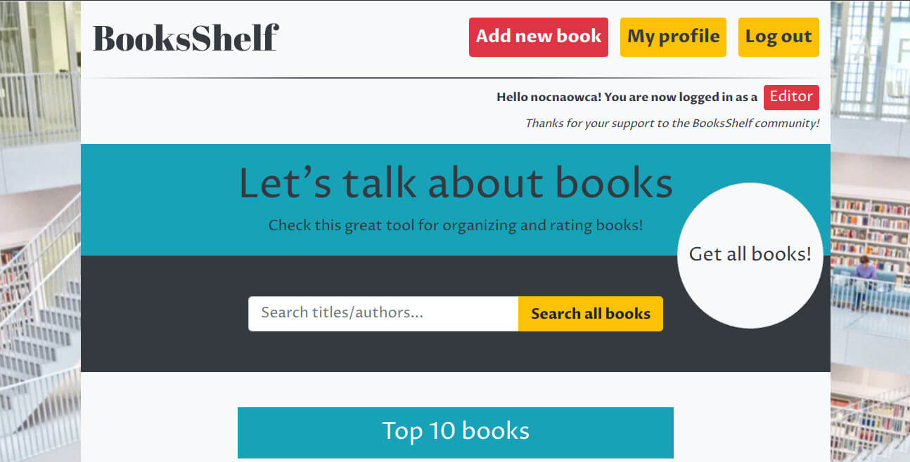

# :books: BooksApp :books:


**Check demo** at :sparkles: [Heroku](https://ibookshelf.herokuapp.com) and **source code** at :house: [GitHub project homepage](https://https://github.com/ireshka/BookShelf)



This app was created as a part of the fourth CodersCamp project (2019/2020, Warsaw group) - backend JavaScript, introduction to Node.js. You can check the source repo at [Mentor repo](https://github.com/dobrzyckahanna/BookStore) if you want to know how we've collaborated during project.

We created an app (with books database) in which you are able to add / edit / delete books as editor (authorization) and add comments and rating after registration and login (comment option is now restricted to users with editor privilege).

## What I learned and actual project status
That was my second group project that I completed during Coderscamp initiative that included both frontend and backend layers.

Aside from code related stuff, the project taught me how to divide tasks among the group, to plan work and prioritize assignments.

We chose Pug template engine and Bootstrap styling for quick development that allowed us to focus on business logic.

After a few months I see many fields that could be improved due to my wider coding knowledge but I probably won't fix bugs here and will use this project experience to build another books-related app. Stay tuned.

## :blue_book: Getting Started
### Prerequisites
To run the project on your local machine for development and testing purposes you need to install the following software:
* [node.js](https://nodejs.org/en/) & [npm](https://www.npmjs.com/get-npm)
* [MongoDB](https://www.mongodb.com/what-is-mongodb) - create cloud database

### Install & usage (bash)
1. Clone repository 
```
git clone https://github.com/ireshka/BookShelf.git
```
2. Install required project dependencies
```
cd BookShelf
npm i
```
3. [Create your database on MongoDB Atlas](https://www.mongodb.com/cloud/atlas) and add .env file to your repository (main folder)
```
DB_USER=your Atlas database user name (not user name to Mongo account)
DB_PASSWORD=your Atlas database password (not password to Mongo account)
DB_DATABASE_ADDRESS=your Atlas database address
DB_DATABASE_NAME=your Atlas database name
NODE_ENV=development
DEBUG=app:startup,app:db
DEBUG_COLORS=true
DEBUG_FD=1
JWT_PRIVATEKEY=your secret jwt key
SESSION_SECRET=your secret session key
```

4. Run developer server
```
npm start
```
5. To see and test app open on [localhost:3000](http://localhost:3000)

## :orange_book: Technologies:
### Project requirements:
* database (relational or non-relational), its maintenance & input validation
* client/server communication, HTTP request handling
* template engine & CSS framework
* environment variables
* authorization & authentication

### Used technologies:
* JavaScript (including ES6+ features)
* MongoDB, mongoose, joi
* Express.js
* Pug template eningines &  Bootstrap framework
* dotenv, config
* bcryptjs, jsonwebtoken
* cookies handling: cookie-parser
* error handling: connect-flash, express-messages, express-session

### Main features:
* MongoDB Atlas cloud database handling
* debug with use morgan & debugger package
* CRUD operation for creating and browsing books
* user registration and login (authentication)
* editor with additional permissions (authorization)
* form handling (book: add, edit, add rate & review, user: registration & login)
* book deletion handling
* top 10 books (key: descending ratings)
* search engine (key: author or book title)
* heroku deployment

## :busts_in_silhouette: Authors
* **adamsobiesak** - check at [Github](https://github.com/adamsobiesak)
* **apiwonska** - check at [Github](https://github.com/apiwonska)
* **ceglarzagata** - check at [Github](https://github.com/ceglarzagata)
* **freefrogs** - check at [Github](https://github.com/freefrogs)
* **ireshka** - check at [Github](https://github.com/ireshka)
* **Kombajn27** - check at [Github](https://github.com/Kombajn27)
* **natkalia** - check at [Github](https://github.com/natkalia)

## :green_book: Credits
* background image [Unsplash](https://unsplash.com/)
* books descriptions [Wikipedia](https://en.wikipedia.org/)
